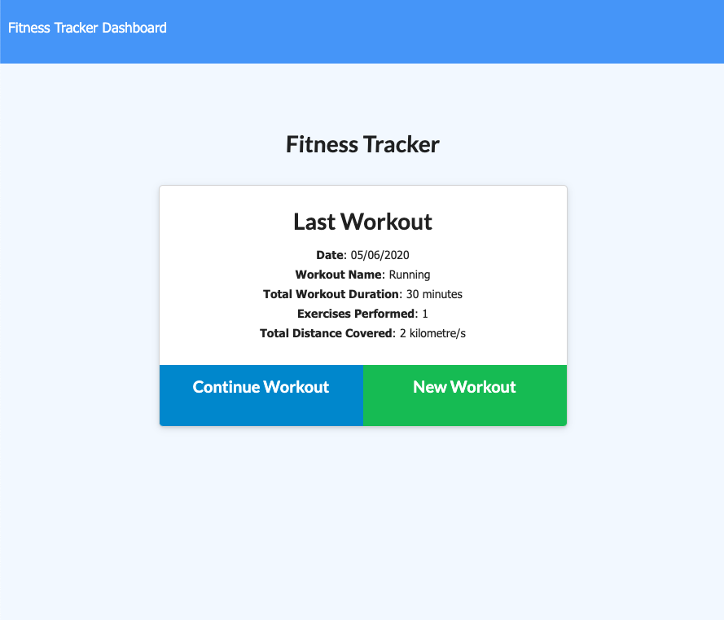
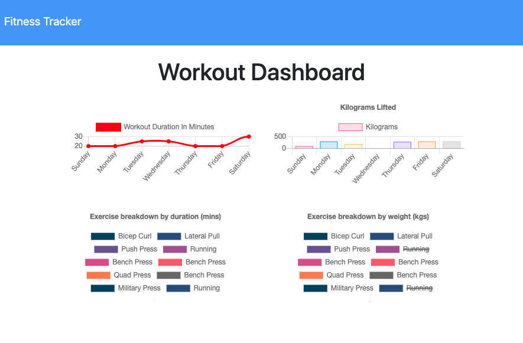
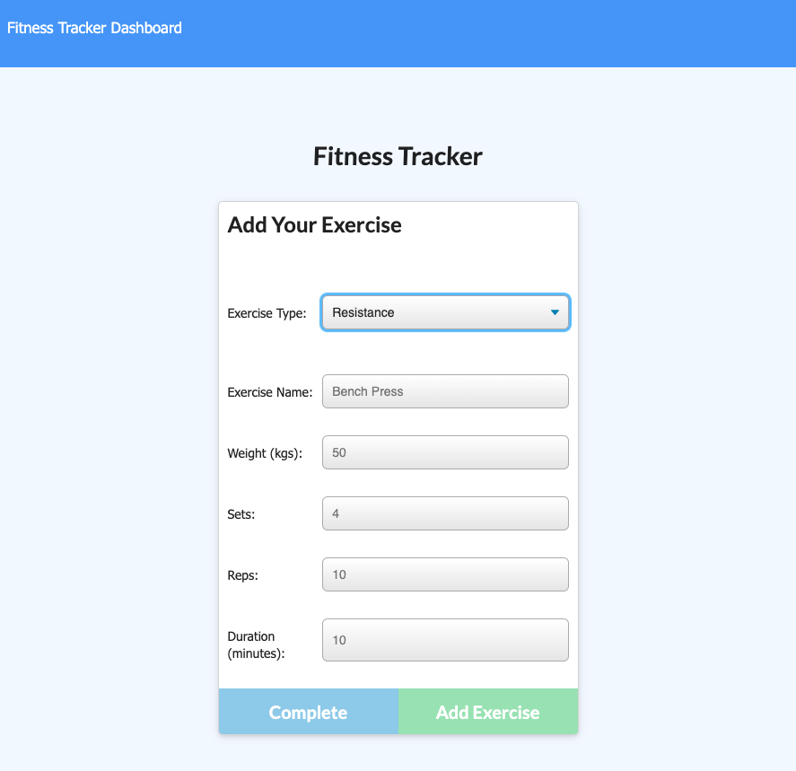

# Fitness-Tracker

<svg xmlns="http://www.w3.org/2000/svg" xmlns:xlink="http://www.w3.org/1999/xlink" width="96" height="20"><linearGradient id="b" x2="0" y2="100%"><stop offset="0" stop-color="#bbb" stop-opacity=".1"/><stop offset="1" stop-opacity=".1"/></linearGradient><clipPath id="a"><rect width="96" height="20" rx="3" fill="#fff"/></clipPath><g clip-path="url(#a)"><path fill="#555" d="M0 0h79v20H0z"/><path fill="#97ca00" d="M79 0h17v20H79z"/><path fill="url(#b)" d="M0 0h96v20H0z"/></g><g fill="#fff" text-anchor="middle" font-family="DejaVu Sans,Verdana,Geneva,sans-serif" font-size="110"> <text x="405" y="150" fill="#010101" fill-opacity=".3" transform="scale(.1)" textLength="690"></text><text x="405" y="140" transform="scale(.1)" textLength="690">Version</text><text x="865" y="150" fill="#010101" fill-opacity=".3" transform="scale(.1)" textLength="70"></text><text x="865" y="140" transform="scale(.1)" textLength="160">1.0</text></g> </svg>

## Description

A fitness tracker to create and track daily workouts. An application to be able to log multiple exercises in a workout on a given day.

## Table of Contents

- [Description](#description)
- [Screenshot](#screenshot)
- [Installation](#installation)
- [Usage](#usage)
- [Project Status](#project-status)
- [Authors and Acknowledgment](#authors-and-acknowledgment)
- [License](#license)

## Screenshot

## Installation

The application has been deployed on Heroku and is available [here](https://obscure-stream-55645.herokuapp.com/)

## Usage

When the user loads the main page, they are given the option to create a new workout, or continue with their last workout.

The user is able to:

- Add exercises to a previous workout plan.

- Add new exercises to a new workout plan.

- View the combined weight of multiple exercises on the `Dashboard` page.

## Project Status

- The database structure is mostly implemented however the days components is not universal.

- Stats sent to te dashboard don't follow an actual day structure and the `days` are just hardcoded into charts

- exercise page isn't very intuitive to know if you are continuing or beginning a workout.

## Authors and Acknowledgment

### Main Author

[DCRevResLabs](https://github.com/DCRevResLabs)

## License

© 2020 Revolution Research Laboratories Pty.Ltd. All Rights Reserved.
